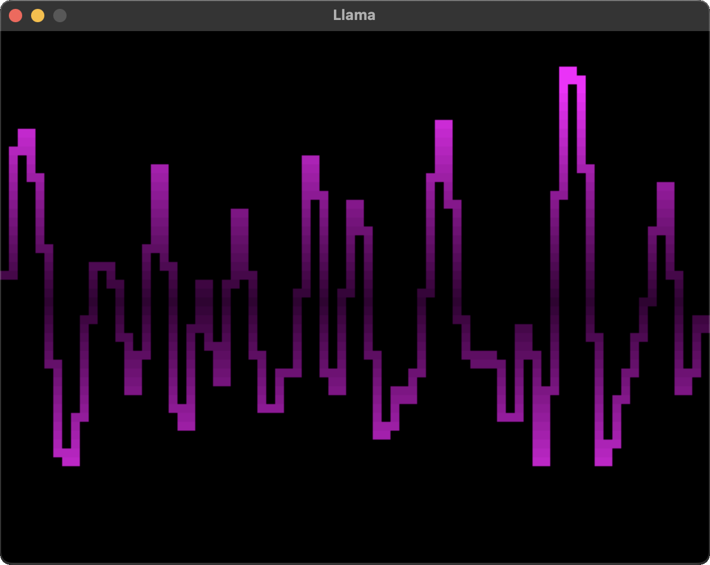

# Language for Live Audio Module Arrangement

[](https://github.com/gridbugs/llama/actions/workflows/test.yml)

*The llama is a domesticated South American camelid.*


## About

`llama` is a library for building software-defined modular synthesizers in a
declarative style. It can be used to implement programs that generate audio
using components commonly found in synthesizers such as oscillators, envelope
generators, and low/high pass filters. It can also be used from `utop` or other
ocaml repl environments to perform music live.


## Llama in Action

Videos showing off some of the example programs:
- [polyphonic_events](https://youtu.be/o-XPH1j0NqE)
- [random_pentatonic](https://youtu.be/wfmmdRo_ytU)
- [echo_effect](https://youtu.be/1ndhPlvDBH8)
- [interactive](https://youtu.be/O8oc7MhG4uE)
- [midi_player](https://youtu.be/A8a1Dem2eKs)

## Getting Started

This project depends on the external dependency `libao` to get access to your
soundcard. Install it with your package manager. Then you should be able to
build and some example programs:
```
$ dune exec ./examples/polyphonic_events.exe
$ dune exec ./examples/random_pentatonic.exe
$ dune exec ./examples/echo_effect.exe
```


## Interactive Demo



Run `dune exec examples/interactive.exe` and then use your computer's keyboard
to play music. The top and bottom rows of letters are the white keys and the
number row and middle row of letters are the black keys. The mouse position
controls the frequency cutoff and resonance of a low-pass filter. Hack
examples/interactive.ml to change how it sounds!


## Concepts

The `'a Signal.t` type represents a buffered stream of values of type `'a` and
is central to the API of `llama`. These are used to send audio and control
signals through a network of components. For example:

```ocaml
(* This is a complete example. Paste this into a file and run it to see what
   it does, or just run:

   $ dune exec ./examples/from_readme.exe
*)

open Llama
open Dsl

(* [osc] represents a signal whose value varies between -1 and 1 according
   to a 440Hz sine wave. *)
let osc : float Signal.t = oscillator (const Sine) (const 440.0)

(* [note_gate] represents a signal whose value is either [true] or [false]
   which changes from [false] to [true] twice per second, and spends 30% of the
   time on. This is often used to communicate the fact that a key is pressed to
   a module that responds to such events. The [Signal.Gate.t] type is a wrapper
   of [bool Signal.t]. *)
let note_gate : Signal.Gate.t =
  periodic_gate ~frequency_hz:(const 2.0) ~duty_01:(const 0.3)

(* [envelope] is a signal which is 0 while its [gate] argument is producing
   [false] values, but which raises to 1 over the course of [attack_s] seconds
   when [gate] transitions to [true], and transitions back to [false] when
   [gate] transitions to [false]. Note that even though it is also a [float
   Signal.t] like [osc] is, it doesn't contain audio data. Instead an envelope
   is typically used to modulate a signal in response to a key press, which we
   are simulating here with [note_clock]. *)
let envelope : float Signal.t =
  ar_linear ~gate:note_gate ~attack_s:(const 0.01) ~release_s:(const 0.2)

(* Multiply the oscillator with the envelope to produce a repeating
   burst of volume which gradually tapers off twice per second. *)
let output : float Signal.t = osc *.. envelope

(* Play the sound! *)
let () = play_signal (output |> scale 0.1)
```


## Example Live Session

Start a utop session with the `Llama` module available by running `dune utop`,
then enter this into the utop repl.

```ocaml
open Llama.Live;;

(* Define a sequence of frequencies and durations. *)
let steps = [ Some (110.0, 0.1); Some (123.47, 0.1); Some (98.0, 0.2); None ]
|> List.map (Option.map (fun (freq, period) -> { value = const freq; period_s = const period }));;

(* Create a sequencer to play the notes. *)
let { value = freq; gate } = sustained_step_sequencer steps (clock (const 4.0));;

(* Create an oscillator to buzz at the frequency selected by the sequencer. *)
let osc = oscillator (const Saw) freq;;

(* Create an envelope generator to shape the volume according to the gate. *)
let env = ar_linear ~gate ~attack_s:(const 0.01) ~release_s:(const 0.2);;

(* Use the envelope to control the volume of the oscillator. *)
let amp = osc *.. env

(* Create a player returning a `float t ref` which can be set to the signal we want to play. *)
let out = go ();;

(* Play! *)
out := amp;;

(* To silence playback you can change the output to [silence]. *)
out := silence;;
```
